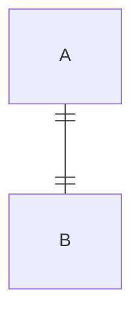
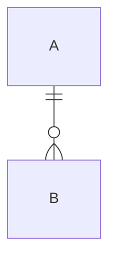
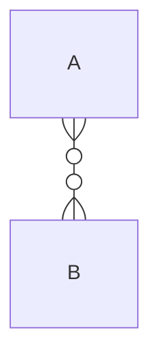

<span style="color: red;">※ <code class="language-plaintext highlighter-rouge" style="color:red; font-size: 1.4rem;">mermaid</code><b> 사용하려면 프론트매터에 추가!!</b></span><br>

<h2 id="cardinality">Cardinality</h2>
<h3 id="one-to-one">&nbsp;&nbsp;1:1(One to One)</h3>

```
erDiagram
    A ||--|| B: ""
```


<h3 id="one-to-many">&nbsp;&nbsp;1:M(One to Many)</h3>

```
erDiagram
    A ||--o{ B: ""
```


<h3 id="many-to-many">&nbsp;&nbsp;M:M(Many to Many)</h3>

```
erDiagram
    A }o--o{ B: ""
```


<h2 id="config-for-er">설정 정보</h2>
- <a href="https://mermaid.js.org/config/schema-docs/config-defs-er-diagram-config.html" target="_blank">공식문서</a><br>
- <a href="https://mermaid.js.org/schemas/config.schema.json" target="_blank">설정 스키마</a><br>
- <a href="https://github.com/mermaid-js/mermaid/blob/bcb0817ecd24a4e09212cca02cec3c56ab76e32b/packages/mermaid/src/diagrams/er/styles.js" target="_blank"><code class="language-plaintext highlighter-rouge" style="font-size: 1rem;">er/styles.js</code> 코드</a>
<br>