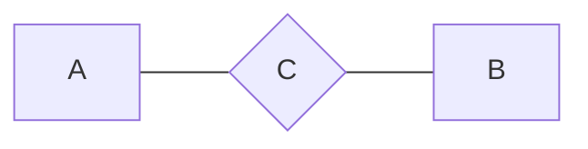
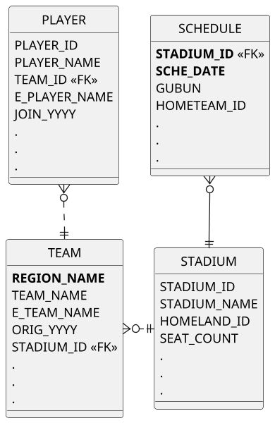
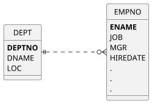

<h2 id="database">1. 데이터베이스</h2>

<b>DBMS</b> 
&nbsp;\- 많은 사용자들의 보다 효율적 데이터의 관리 
&nbsp;\- 예기치 못한 사건으로 인한 데이터 손상 방지 
&nbsp;\- 필요 데이터 복구 위한 강력한 기능의 SW 필요성 

<h3 id="rdb" data-heading-label="1.1. 관계형 데이터베이스">&nbsp;&nbsp;1.1. 관계형 데이터베이스</h3>
&nbsp;\- 정규화 통한 합리적 테이블 모델링 
&nbsp;&nbsp;&nbsp;&nbsp;=> 이상ANOMALY 현상 제거, 데이터중복 피함. 
&nbsp;\- 동시성 관리, 병행 제어 
&nbsp;\- 메타 데이터 총괄 관리 가능 
&nbsp;&nbsp;&nbsp;&nbsp;=> 데이터의 성격, 속성, 표현 방법 등 체계화 가능 
&nbsp;\- 데이터 표준화 통한 데이터 품질 확보 

 
<h2 id="sql" data-heading-label="2. SQL">2. SQLStructured Query Language</h2>
<h3 id="sql-h3" data-heading-label="2.1. SQL이란?">&nbsp;&nbsp;2.1. SQL이란?</h3>
\: 관계형 DB에서 데이터 정의, 데이터 조작, 데이터 제어 위해 사용하는 언어 

관계형 DB는 수학의 집합 논리에 입각함. 
&nbsp;=> SQL도 데이터를 집합으로써 취급. 
&nbsp;&nbsp;ex) '포지션이 MF인 선수의 정보 검색' 상황에선, 
&nbsp;&nbsp;&nbsp;&nbsp;&nbsp;&nbsp;선수라는 큰 집합에서 포지션이 MF인 조건 만족하는 요구 집합 추출하는 조작. 

<h3 id="sql-stmt-types" data-heading-label="2.2. SQL 문장들의 종류">&nbsp;&nbsp;2.2. SQL 문장들의 종류</h3>
<table style="text-align: center;" align="left">
    <tr style="font-weight:bold; background: #e0e0e0;">
        <td>명령어 종류</td>
        <td>명령어</td>
        <td>설명</td>
    </tr>
    <tr>
        <td rowspan="2">데이터 조작어 (DML; Data Manipulation Language)</td>
        <td><code class="language-sql highlighter-rouge" style="color: #83060e; font-size: 1.0rem;"><b>SELECT</b></code></td>
        <td>DB의 데이터 조회, 검색 위한 명령어. <code class="language-sql highlighter-rouge" style="color: #83060e; font-size: 1.0rem;"><b>RETRIEVE</b></code>라고도 함.</td>
    </tr>
    <tr>
        <td><code class="language-sql highlighter-rouge" style="color: #83060e; font-size: 1.0rem;"><b>INSERT</b></code> <code class="language-sql highlighter-rouge" style="color: #83060e; font-size: 1.0rem;"><b>UPDATE</b></code> <code class="language-sql highlighter-rouge" style="color: #83060e; font-size: 1.0rem;"><b>DELETE</b></code></td>
        <td>DB의 테이블의 데이터에 변형(삽입, 삭제, 수정 등) 가하는 종류의 명령어들.</td>
    </tr>
    <tr>
        <td>데이터 정의어 (DDL; Data Definition Language)</td>
        <td><code class="language-sql highlighter-rouge" style="color: #83060e; font-size: 1.0rem;"><b>CREATE</b></code> <code class="language-sql highlighter-rouge" style="color: #83060e; font-size: 1.0rem;"><b>ALTER</b></code> <code class="language-sql highlighter-rouge" style="color: #83060e; font-size: 1.0rem;"><b>DROP</b></code> <code class="language-sql highlighter-rouge" style="color: #83060e; font-size: 1.0rem;"><b>RENAME</b></code></td>
        <td>테이블 등의 데이터 구조 정의할 때 사용되는 명령어들로, 생성, 변경, 삭제, 이름변경 관련 명령어들.</td>
    </tr>
    <tr>
        <td>데이터 제어어 (DCL; Date Control Language)</td>
        <td><code class="language-sql highlighter-rouge" style="color: #83060e; font-size: 1.0rem;"><b>GRANT</b></code> <code class="language-sql highlighter-rouge" style="color: #83060e; font-size: 1.0rem;"><b>REVOKE</b></code> </td>
        <td>DB에 접근하고 객체 사용하도록 권한 주고 회수하는 명령어.</td>
    </tr>
    <tr>
        <td>트랜잭션 제어어 (TCL; Transaction Control Language)</td>
        <td><code class="language-sql highlighter-rouge" style="color: #83060e; font-size: 1.0rem;"><b>COMMIT</b></code> <code class="language-sql highlighter-rouge" style="color: #83060e; font-size: 1.0rem;"><b>ROLLBACK</b></code> </td>
        <td>논리적 작업의 단위를 묶어서 DML에 의해 조작된 결과를 트랜잭션 별로 제어하는 명령어.</td>
    </tr>
</table>

 
<h2 id="table">3. TABLE</h2>
&nbsp;데이터는 RDB의 기본 단위인 테이블 형태로 저장됨. 모든 자료는 테이블에 등록 되고, 테이블로부터 원하는 자료 꺼내옴. 
&nbsp;테이블은 어느 특정 주제와 목적으로 만들어지는 일종의 집합. 

<h3 id="table-h3" data-heading-label="3.1. 테이블이란?">&nbsp;&nbsp;3.1. 테이블이란?</h3>
&nbsp;&nbsp;\: 데이터를 저장하는 객체Object로서 RDB의 기본 단위. 

<h3 id="table-normaliz" data-heading-label="3.2. 정규화">&nbsp;&nbsp;3.2. 정규화</h3>
&nbsp;&nbsp;\: 테이블을 복수의 테이블로 분할하여 데이터의 불필요한 중복 줄이는 것. 

&nbsp;&nbsp;데이터 정합성 확보와 데이터 입력/수정/삭제 시 발생가능한 이상현상Anomaly 방지 위해 매우 중요한 프로세스임. 

<h3 id="keys" data-heading-label="3.3. 기본키와 외부키">&nbsp;&nbsp;3.3. 기본키와 외부키</h3>
&nbsp;&nbsp;<b>기본키</b>Primary Key 
&nbsp;&nbsp;&nbsp;\: 테이블에 존재하는 각 행을 한 가지 의미로 특정할 수 있는 한 개 이상의 Column. 
&nbsp;&nbsp;<b>외래키</b>Foreign Key 
&nbsp;&nbsp;&nbsp;\: 다른 테이블의 기본키로 사용되고 있는 관계 연결하는 Column. 

 
<h2 id="erd">4. ERDEntity Relationship Diagram</h2>
\: 테이블 간 서로의 상관 관계를 그림으로 도식화한 것. 

<h3 id="components" data-heading-label="4.1. 구성요소">&nbsp;&nbsp;4.1. 구성요소</h3>

(A, B: 엔터티 / C: 관계) 
&nbsp;\- 엔터티 
&nbsp;\- 관계 
&nbsp;\- 속성 

 
위 테이블 간의 양방향 관계는 다음과 같다. 

&nbsp;\- 하나의 팀은 여러 명의 선수 포함할 수 있다. 
&nbsp;\- 한 명의 선수는 하나의 팀에 꼭 속한다. 

&nbsp;\- 하나의 팀은 하나의 전용 구장을 꼭 가진다. 
&nbsp;\- 하나의 운동장은 하나의 홈팀을 가질 수 있다. 

&nbsp;\- 하나의 운동장은 여러 게임 스케줄을 가질 수 있다. 
&nbsp;\- 하나의 스케줄은 하나의 운동장에 꼭 배정된다. 

 

사원-부서 테이블 간 양방향 관계는 다음과 같다. 

&nbsp;\- 하나의 부서는 여러 명의 사원을 보유할 수 있다. 
&nbsp;\- 한 명의 사원은 하나의 부서에 꼭 소속된다. 